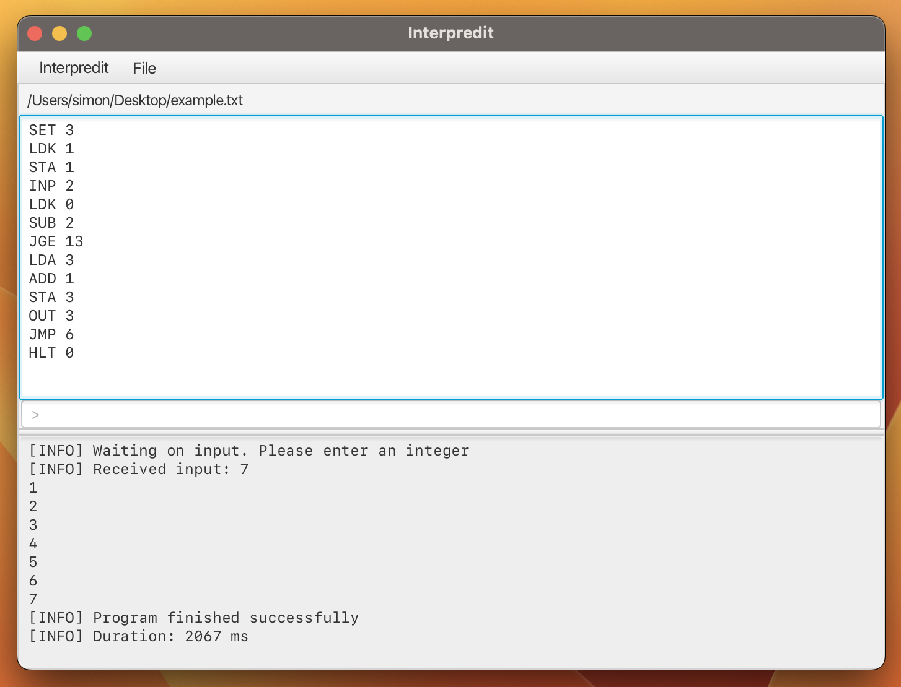

    

  **Interpredit** is a simple editor for writing and running random access machine programs.

  
  
  

---

## 🔎 Table of Contents

- [🎯 About](#about)
- [🚀 Getting Started](#getting_started)
- [🚀 Resources](#resources)
- [⚖️ License](#license)

## 🎯 About

Interpredit enables the writing and execution of random access machine programs. Analogous to the Turing machine,
the data memory corresponds to a (here finite) tape whose content can be manipulated using predefined commands.
Interpredit also has the option of saving the written programs so that no brilliant idea is lost 😁!

The following program in the preview represents a loop that counts from 1 to the input value.

## 🚀 Getting Started

## 📦 Resources

- [Inside Interpredit](docs/INSIDE_INTERPREDIT.md)&nbsp;&nbsp;&nbsp;&nbsp;&nbsp;To learn more about the architecture 
                                                                                and implementation of Interpredit
- [Documentation](docs/DOCUMENTATION.md)&nbsp;&nbsp;&nbsp;&nbsp;&nbsp;A description of all commands and how they 
                                                                      manipulate the tape

## ⚖️ License

Interpredit is released under the GNU GPL-3.0 license. See [LICENSE](LICENSE) for details.
