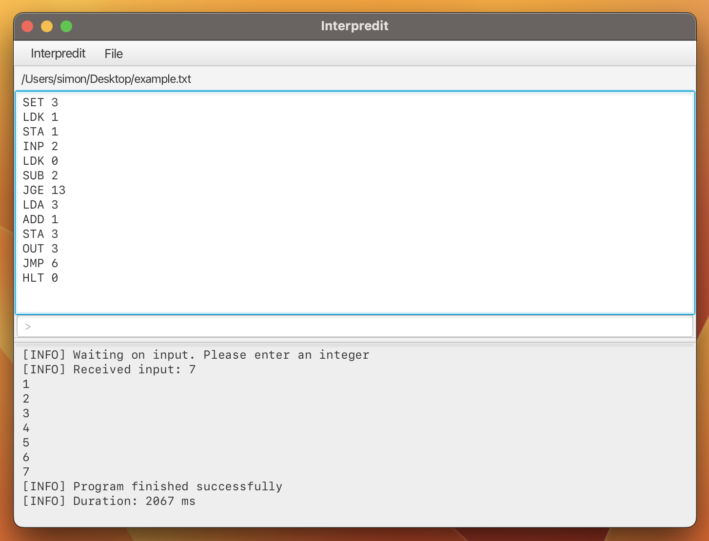

<div align="center">
  <br><br>

  **Interpredit** is a simple editor for writing and running random access machine programs.

  [](https://github.com/simonsuska/interpredit/releases)
  [](https://www.oracle.com/java/)
  [](https://github.com/simonsuska/interpredit/blob/main/LICENSE)
</div>

---

## 🔎 Table of Contents

- [🎯 About](#about)
- [🚀 Getting Started](#getting_started)
- [🚀 Resources](#resources)
- [⚖️ License](#license)

<div id="about"></div>

## 🎯 About

Interpredit enables the writing and execution of random access machine programs. Analogous to the Turing machine,
the data memory corresponds to a (here finite) tape whose content can be manipulated using predefined commands.
Interpredit also has the option of saving the written programs so that no brilliant idea is lost 😁!

The following program in the preview represents a loop that counts from 1 to the input value.



This project uses [conventional commits](https://www.conventionalcommits.org/en/v1.0.0/) since October 4, 2025.

<div id="getting_started"></div>

## 🚀 Getting Started

### Standalone (mac-aarch64 only)

Download the latest Interpredit release from the [releases page](https://github.com/simonsuska/interpredit/releases) and
run it with `java -jar Interpredit-1.0.1.jar`. Unfortunately, this is currently only possible for Macs with an M 
processor, as the JAR contains platform-specific graphics libraries.

### Run from the sources

#### Prerequisites
- Java 22
- Maven 3.9.6 (at least)
- Git
- Your favorite IDE

Open a PowerShell or Terminal window. Make sure `JAVA_HOME` is set correctly.

```
git clone https://github.com/simonsuska/interpredit.git
cd Interpredit
git checkout main
mvn clean package
```

This generates the platform-specific JAR that can be executed on your target system. Subsequently, the JAR is located in 
the `/target` folder in the project root. From the project root, you can execute it with 
`java -jar target/Interpredit-1.0.1.jar `.

<div id="resources"></div>

## 📦 Resources

- [Inside Interpredit](docs/INSIDE_INTERPREDIT.md)&nbsp;&nbsp;&nbsp;&nbsp;&nbsp;To learn more about the architecture 
                                                                                and implementation of Interpredit
- [Documentation](docs/DOCUMENTATION.md)&nbsp;&nbsp;&nbsp;&nbsp;&nbsp;A description of all commands and how they 
                                                                      manipulate the tape

<div id="license"></div>

## ⚖️ License

Interpredit is released under the MIT license. See [LICENSE](LICENSE) for details.
