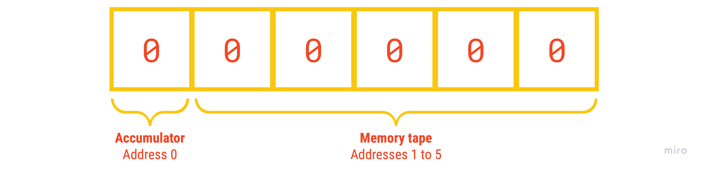
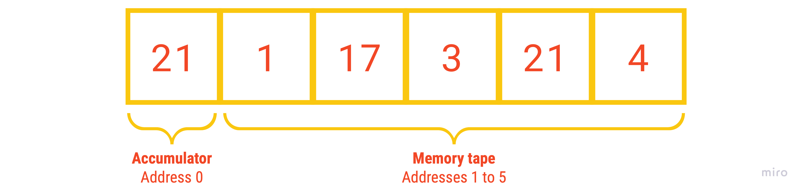
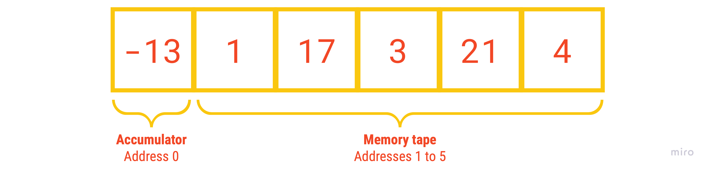
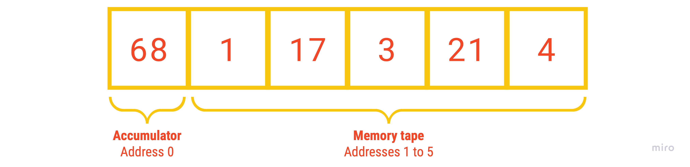
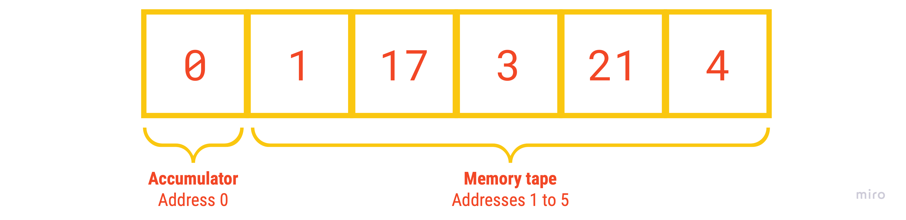
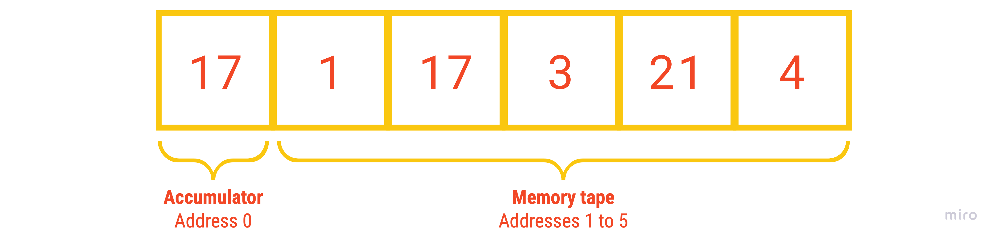
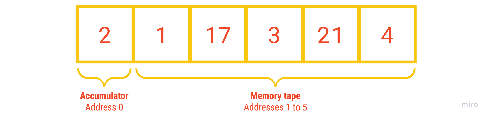

# Documentation

- [️🚦 Start and End](#start_and_end)
- [➕ Arithmetic Operations](#arithmetic_operations)
- [🧠 Save and Load](#save_and_load)
- [📭 Input and Output](#input_and_output)
- [🐇 Jumps](#jumps)

All commands have the same syntax: `CMD VAL`, e.g. `ADD 7`. \
Below you will find a detailed description of all commands.

<div id="start_and_end"></div>

## 🚦 Start and End

### `SET`

---

**Description** \
The SET command initializes the memory (the tape) with the given number of fields and must be the
first command in every program. All fields are initialized with the number 0.

- **Value**: The number of memory fields to be initialized
- **Value range**: `[0;100]`

**Example** \
`SET 5` initializes the memory as follows.



### `HLT`

---

**Description** \
The HLT command marks the end of a program and must be the last command in every program. 

- **Value**: Unused, only for conformity purposes
- **Value range**: `[INT_MIN;INT_MAX]`

**Example** \
`HLT 0` marks the end of a program.

<div id="arithmetic_operations"></div>

## ➕ Arithmetic Operations

### `ADD`

---

**Description** \
The ADD command adds the value stored in the given memory address to the value currently 
stored in the accumulator.

- **Value**: The memory address containing the value that is added to the value in the accumulator
- **Value range**: `[1;SET_VALUE]`

**Example** \
`ADD 2` takes the value in memory address 2 (which is 17) and adds it to the accumulator. 
The result of this addition is 21 and remains in the accumulator.

Before the addition:


After the addition:



### `SUB`

---

**Description** \
The SUB command subtracts the value stored in the given memory address from the value currently
stored in the accumulator.

- **Value**: The memory address containing the value that is subtracted from the value in the accumulator
- **Value range**: `[1;SET_VALUE]`

**Example** \
`SUB 2` takes the value in memory address 2 (which is 17) and subtracts it from the accumulator.
The result of this subtraction is -13 and remains in the accumulator.

Before the subtraction:


After the subtraction:



### `MUL`

---

**Description** \
The MUL command multiplies the value stored in the given memory address to the value currently
stored in the accumulator.

- **Value**: The memory address containing the value that is multiplied to the value in the accumulator
- **Value range**: `[1;SET_VALUE]`

**Example** \
`MUL 2` takes the value in memory address 2 (which is 17) and multiplies it to the accumulator.
The result of this multiplication is 68 and remains in the accumulator.

Before the multiplication:


After the multiplication:



### `DIV`

---

**Description** \
The DIV command divides the value stored in the given memory address from the value currently
stored in the accumulator. Any resulting decimal places are cut off.

- **Value**: The memory address containing the value that is divided from the value in the accumulator
- **Value range**: `[1;SET_VALUE]`

**Example** \
`DIV 2` takes the value in memory address 2 (which is 17) and divides it from the accumulator.
The result of this subtraction is 0 (exactly 0.235, but the decimal places are cut off) and remains 
in the accumulator.

Before the division:


After the division:



<div id="save_and_load"></div>

## 🧠 Save and Load

### `LDA`

---

**Description** \
The LDA command loads the value stored in the given memory address into the accumulator and thus 
overrides the currently stored value in the accumulator.

- **Value**: The memory address containing the value that is loaded into the accumulator
- **Value range**: `[1;SET_VALUE]`

**Example** \
`LDA 2` takes the value in memory address 2 (which is 17) and loads it into the accumulator.

Before loading:


After loading:



### `LDK`

---

**Description** \
The LDK command loads the given value into the accumulator and thus overrides the currently stored 
value in the accumulator.

- **Value**: The value that is loaded into the accumulator
- **Value range**: `[INT_MIN;INT_MAX]`

**Example** \
`LDK 2` takes the value 2 and writes it into the accumulator.

Before loading:


After loading:



### `STA`

---

**Description** \
The STA command stores the currently stored value in the accumulator in the given memory address.

- **Value**: The memory address the value in the accumulator is stored in
- **Value range**: `[1;SET_VALUE]`

**Example** \
`STA 2` takes the value in the accumulator (which is 4) and writes it in the memory address 2.

Before storing:


After storing:


<div id="input_and_output"></div>

## 📭 Input and Output

### `INP`

---

**Description** \
The INP command stores the user input in the given memory address. The program execution
is paused until a user input is made. User input made before the program is actually executed is also taken into 
account.

- **Value**: The memory address the user input is stored in
- **Value range**: `[1;SET_VALUE]`

**Example** \
`INP 2` takes the user input and writes it in the memory address 2.

### `OUT`

---

**Description** \
The OUT command outputs the value stored in the given memory address on the console.

- **Value**: The memory address containing the value that is output on the console
- **Value range**: `[1;SET_VALUE]`

**Example** \
`OUT 2` takes the value stored in the memory address 2 and outputs it on the console.

<div id="jumps"></div>

## 🐇 Jumps

### `JMP`

---

**Description** \
The JMP command causes the program execution to continue in the given line of code. The program
is trapped in an infinite loop if the target line of code is beyond the SET or HLT command.

- **Value**: The line of code the program execution should continue in
- **Value range**: `[1;LINES_OF_CODE]`

**Example**
```
4: ...
5: SUB 1
6: STA 2
7: JMP 9
8: OUT 2
9: HLT 0
```
`JMP 9` causes the program execution to continue in line 9. This results in the OUT command in 
line 8 not being executed.

### `JEZ`

---

**Description** \
The JEZ command causes the program execution to continue in the given line of code, if the currently 
stored value in the accumulator is equal to 0. Otherwise, the program execution continues in the 
next line of code. The program is trapped in an infinite loop if the target line of code is beyond 
the SET or HLT command.

- **Value**: The line of code the program execution should continue in
- **Value range**: `[1;LINES_OF_CODE]`

**Example**
```
4:  ...
5: SUB 1
6: STA 2
7: OUT 2
8: JEZ 5
9: HLT 0
```
`JEZ 5` causes the program execution to continue in line 5 (which is the `SUB 1` command), if the 
currently stored value in the accumulator is equal to 0. Otherwise, the program execution continues 
in line 9 (which is the `HLT 0` command).

### `JNE`

---

**Description** \
The JNE command causes the program execution to continue in the given line of code, if the currently
stored value in the accumulator is not equal to 0. Otherwise, the program execution continues in the
next line of code. The program is trapped in an infinite loop if the target line of code is beyond
the SET or HLT command.

- **Value**: The line of code the program execution should continue in
- **Value range**: `[1;LINES_OF_CODE]`

**Example**
```
4:  ...
5: SUB 1
6: STA 2
7: OUT 2
8: JNE 5
9: HLT 0
```
`JNE 5` causes the program execution to continue in line 5 (which is the `SUB 1` command), if the
currently stored value in the accumulator is not equal to 0. Otherwise, the program execution 
continues in line 9 (which is the `HLT 0` command).

### `JLZ`

---

**Description** \
The JLZ command causes the program execution to continue in the given line of code, if the currently
stored value in the accumulator is less than 0. Otherwise, the program execution continues in the
next line of code. The program is trapped in an infinite loop if the target line of code is beyond
the SET or HLT command.

- **Value**: The line of code the program execution should continue in
- **Value range**: `[1;LINES_OF_CODE]`

**Example**
```
4:  ...
5: SUB 1
6: STA 2
7: OUT 2
8: JLZ 5
9: HLT 0
```
`JLZ 5` causes the program execution to continue in line 5 (which is the `SUB 1` command), if the
currently stored value in the accumulator is less than 0. Otherwise, the program execution
continues in line 9 (which is the `HLT 0` command).

### `JLE`

---

**Description** \
The JLE command causes the program execution to continue in the given line of code, if the currently
stored value in the accumulator is less than or equal to 0. Otherwise, the program execution continues 
in the next line of code. The program is trapped in an infinite loop if the target line of code is 
beyond the SET or HLT command.

- **Value**: The line of code the program execution should continue in
- **Value range**: `[1;LINES_OF_CODE]`

**Example**
```
4:  ...
5: SUB 1
6: STA 2
7: OUT 2
8: JLE 5
9: HLT 0
```
`JLE 5` causes the program execution to continue in line 5 (which is the `SUB 1` command), if the
currently stored value in the accumulator is less than or equal to 0. Otherwise, the program 
execution continues in line 9 (which is the `HLT 0` command).

### `JGZ`

---

**Description** \
The JGZ command causes the program execution to continue in the given line of code, if the currently
stored value in the accumulator is greater than 0. Otherwise, the program execution continues in the
next line of code. The program is trapped in an infinite loop if the target line of code is beyond
the SET or HLT command.

- **Value**: The line of code the program execution should continue in
- **Value range**: `[1;LINES_OF_CODE]`

**Example**
```
4:  ...
5: SUB 1
6: STA 2
7: OUT 2
8: JGZ 5
9: HLT 0
```
`JGZ 5` causes the program execution to continue in line 5 (which is the `SUB 1` command), if the
currently stored value in the accumulator is greater than 0. Otherwise, the program execution
continues in line 9 (which is the `HLT 0` command).

### `JGE`

---

**Description** \
The JGE command causes the program execution to continue in the given line of code, if the currently
stored value in the accumulator is greater than or equal to 0. Otherwise, the program execution 
continues in the next line of code. The program is trapped in an infinite loop if the target line of 
code is beyond the SET or HLT command.

- **Value**: The line of code the program execution should continue in
- **Value range**: `[1;LINES_OF_CODE]`

**Example**
```
4:  ...
5: SUB 1
6: STA 2
7: OUT 2
8: JGE 5
9: HLT 0
```
`JGE 5` causes the program execution to continue in line 5 (which is the `SUB 1` command), if the
currently stored value in the accumulator is greater than or equal to 0. Otherwise, the program 
execution continues in line 9 (which is the `HLT 0` command).
