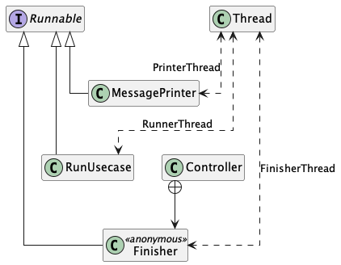

# Inside Interpredit

- [️🏗️ Architecture](#architecture)
- [⚙️ Program Execution](#program_execution)
- [📦 Frameworks and Libraries](#frameworks_and_libraries)

## 🏗️ Architecture

Interpredit is implemented according to the [Clean Architecture](https://blog.cleancoder.com/uncle-bob/2012/08/13/the-clean-architecture.html),
with the presentation layer using the [MVC](https://de.wikipedia.org/wiki/Model_View_Controller) pattern.

### Data

The data layer usually communicates with external data sources, such as databases. In the context of Interpredit, the 
data source is a file. The “communication”, i.e. reading, writing and deleting, takes place via the `FileDatasource` 
class. A special feature in this case is that the data source is not always available, e.g. if no file is open in the 
editor. In this case, of course, reading, writing and deleting is also not possible. This has been solved by making the 
`FileDatasource` a `MutableDatasource` as well. This enables a data source to be (un)set.

### Domain

The domain layer represents the core of the architecture and contains the business logic and entities. Communication 
with the data layer takes place via the repository. This ensures that there are no dependencies from the domain layer 
to the data layer. The entities represent the business objects and provide methods for modifying their state. The 
entities are accessed exclusively via the `InputUsecase`, `OutputUsecase`, `RunUsecase` and `StopUsecase` classes. As 
you may notice, these are exactly the use cases that use the random access machine. Apart from `Status`, all other 
entities are used exclusively by the random access machine. The remaining use cases `CloseUsecase`, `DeleteUsecase`, 
`OpenUsecase` and `SaveUsecase` use the repository internally to enable files to be closed, deleted, opened and saved.

### Presentation

The presentation layer uses the MVC pattern. The controller has references to the FXML user interface. Furthermore,
the controller contains all methods that are linked to UI elements, such as menu items and buttons. The model has an 
analogous method for all of these methods. When the user clicks on a button, for example, the corresponding method in 
the controller is called, which in turn calls the corresponding method in the model. The model then uses the appropriate 
use case to execute the action. This ensures that there is no program-specific logic in the presentation layer.

## ⚙️ Program Execution

During the execution of the program, there are three further threads in addition to the main thread.

### Runner Thread
This thread is started by the model and executes the program line by line.

### Printer Thread
This thread is also started by the model, directly before the runner thread,
and provides output to the user during the program execution. It receives the
current status of the runner thread via an exchanger object, whereupon it
triggers the output of a corresponding message in the main thread.

### Finisher Thread
This thread is started by the controller and waits for the program to finish. It is
informed of the end by the runner thread via a cyclic barrier, whereupon it
enables/disables appropriate menu items.

After the finisher thread has been notified via the cyclic barrier, it executes its
commands and is thus terminated. The runner thread and the printer thread leave
their loop as soon as a status indicates an error or the end of the program. As the
runner thread transmits every status that is not *OK* to the printer thread,
these two threads are also terminated at the end of a program, leaving only the main thread
after the program execution.

## 📦 Frameworks and Libraries

- [Google Guice](https://github.com/google/guice)&nbsp;&nbsp;&nbsp;&nbsp;&nbsp;Dependency Injection
- [JavaFX](https://openjfx.io)&nbsp;&nbsp;&nbsp;&nbsp;&nbsp;User Interface
- [JUnit](https://junit.org/junit5/)&nbsp;&nbsp;&nbsp;&nbsp;&nbsp;Unit Tests
- [Mockito](https://site.mockito.org)&nbsp;&nbsp;&nbsp;&nbsp;&nbsp;Mocking
- [vavr](https://vavr.io)&nbsp;&nbsp;&nbsp;&nbsp;&nbsp;Data structures
